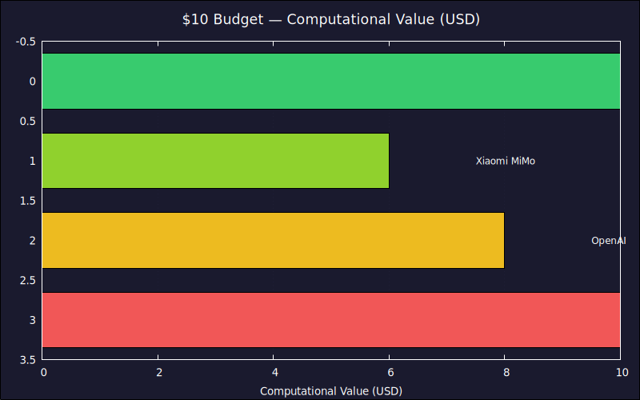

## **Comparative Analysis of AI Model Access Providers (Normalized to a $10 Budget)**

This analysis evaluates subscription-based AI access plans within a tight $10 monthly budget. Several providers offer entry-level subscriptions at this price point, and some deliver surprising value.

> **Scope:** Only providers with recurring monthly subscriptions are included. Pay-as-you-go API providers are not listed here — see the [Free Rankings](#free-rankings.md) for those.

Here is the definitive ranking from **best value for money (Best)** to **least capability per dollar (Worst)**.

### **🥇 1\. OpenCode Go (Subscription)**

* **The Model Class:** Open Flagships (*Qwen 3.7 Max, GLM 5.1, MiMo V2.5 Pro*)  
* **What your $10 gets you:** Exactly covers the $10/month base subscription.  
* **Why it's \#1:** The same 6x value multiplier that makes OpenCode Go the top pick at $20 works just as well at $10. You get **$60 of monthly computational value** ($12 per 5 hours / $30 per week) across flagship open models like Qwen 3.7 Max and GLM 5.1. No other provider comes close to this kind of return on a ten-dollar bill. The layered cap system means you get genuine, sustained access to elite reasoning models — not a teaser or a trickle.

### **🥈 2\. Xiaomi MiMo (Token Plan Lite)**

* **The Model Class:** Open Flagships (*MiMo-V2.5 Pro — 1T total params, 42B active, 1M context*)  
* **What your $10 gets you:** Costs $6/month (¥39/mo), leaving $4 in your pocket. Includes 4.1B monthly credits covering the full MiMo-V2.5 model family.  
* **Why it's \#2:** At just $6, you get access to a genuine frontier model with a 1-million-token context window. The MiMo-V2.5 Pro rivals models that cost significantly more on other platforms. The Lite plan's 4.1B credit pool is smaller than the Standard plan's 11B, but for moderate use — coding sessions, document analysis, experimentation — it's more than enough. And you still have $4 left over for a coffee.

### **🥉 3\. OpenAI ChatGPT Go (Subscription)**

* **The Model Class:** Proprietary Fast Models (*GPT-5.2 Instant*)  
* **What your $10 gets you:** Costs $8/month, leaving $2 in your pocket.  
* **Why it's \#3:** For $8, you get roughly 10x the free tier — approximately 100 messages with GPT-5.2 Instant per 5-hour window, plus file uploads, image generation, and an expanded context window. GPT-5.2 Instant is fast and capable for everyday tasks like writing, learning, and problem-solving. It's not the full flagship GPT-5.2 (that's Plus at $20), but it's a meaningful upgrade over free. The catch: OpenAI is rolling out ads in the Go tier, so your experience will include sponsored content.

### **4\. Grok (SuperGrok Lite)**

* **The Model Class:** Social & Search Flagships (*Grok 4 — Basic*)  
* **What your $10 gets you:** Exactly covers the $10/month Lite subscription.  
* **Why it drops to \#4:** The Lite tier gives you Grok's speed and personality, but limits you to basic capabilities. The actual flagship reasoning engine (Grok 4.3 Standard) is locked behind a $30/month tier. For $10, you get a fast, responsive chatbot that's good for casual questions and quick lookups — but it lacks the deep reasoning and coding capabilities that the other options on this list provide.

## **Charts**

## **Summary Comparison Table**

| Rank | Provider / Plan | Model Tier | $10 Budget Outcome | Limit Vulnerability |
| :---- | :---- | :---- | :---- | :---- |
| **\#1** | **OpenCode Go** | Qwen 3.7 Max / GLM 5.1 | **Best Value:** $10 yields $60 of token value. | Soft value caps ($12/5hr). |
| **\#2** | **Xiaomi MiMo Lite** | MiMo-V2.5 Pro | **Great:** Frontier model + 1M context for $6. | Smaller credit pool (4.1B/mo). |
| **\#3** | **ChatGPT Go** | GPT-5.2 Instant | **Solid:** 10x free tier, file uploads, image gen. | Ads included; not full flagship model. |
| **\#4** | **SuperGrok Lite** | Grok 4 (Basic) | **Limited:** Fast responses, but basic capabilities only. | Flagship reasoning locked behind $30/mo tier. |

💡 **The Strategic Takeaway:** At the $10 price point, **OpenCode Go** is the clear winner — no other provider offers a 6x value multiplier on open flagship models. **MiMo Lite** is the runner-up if you want direct access to a frontier model with a massive context window for even less. **ChatGPT Go** is a solid everyday option if you prefer OpenAI's ecosystem and don't mind ads.

---

*Note: Many providers that appear in the [$20 Budget Analysis](#20-rankings.md) — including ChatGPT Plus ($20), Google AI Pro ($19.99), Claude Pro ($20), and Z.ai GLM ($18) — have subscriptions that exceed the $10 threshold. If your budget can stretch, those options open up significantly more possibilities.*
