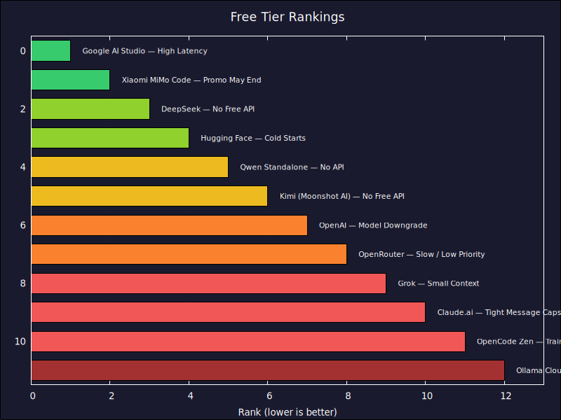

## **Free AI Model Access: A Developer's Guide**

This analysis evaluates free tiers from major AI providers. If you're a developer working on a small project, experimenting with AI capabilities, learning prompt engineering, or prototyping an idea before committing to a paid plan, these options give you real access without spending a dollar. The trade-offs are real — but for hands-on exploration, they're more than enough.

### **Free Tier Rankings (Best to Worst for Small Projects)**

#### **🥇 1. Google AI Studio (Gemini 1.5 Pro / Flash)**
*   **The Deal:** Massive free quotas for Gemini 1.5 series.
*   **What you get:** Extremely generous token limits and a 1M+ context window, with full API access.
*   **Things to Consider:** **Severe Latency.** On the free tier, request processing can be sluggish, and you may hit rate limit errors during heavy use. Data is also used for model improvement.
*   **Why it's \\#1:** No other free tier comes close to the raw volume of tokens you get. The 1-million-token context window alone is worth the price of admission (zero), and the API access means you can build real tools around it. Latency is the only real cost.
*   **Verdict:** Best for experimenting with large-context tasks. Great for prototyping ideas that need to process long documents or big codebases — just be patient with response times.

#### **🥈 2. Xiaomi MiMo Code (Free for Limited Time)**
*   **The Deal:** MiMo Code, a terminal-native AI coding agent, is free to use via the MiMo Auto provider.
*   **What you get:** Full access to MiMo-V2.5 Pro (1T params, 42B active, 1M context) through a complete coding agent. No login or credit card required — install with one command.
*   **Things to Consider:** **Limited-Time Offer.** The free access is promotional and may end without notice. There is no permanent free API tier — once the promotion ends, you'll need a Token Plan ($6+/mo) or pay-as-you-go credits.
*   **Why it's \\#2:** This is a frontier-class model with a 1M context window, delivered through a full-featured coding agent, for free. No other free option gives you both a top-tier model and a complete development workflow in one package. The only reason it's not \\#1 is that the free access is time-limited — enjoy it while it lasts.
*   **Verdict:** The best free coding experience available right now. If you're curious about what frontier models can do, this is the lowest-friction way to find out.

#### **🥉 3. DeepSeek (Free Chat)**
*   **The Deal:** Free access to DeepSeek-V4 via chat.deepseek.com and the mobile app.
*   **What you get:** Full access to DeepSeek's flagship V4 model with 1M token context window, thinking mode, and multimodal capabilities. No subscription, no credit card — completely free.
*   **Things to Consider:** **Web/App Only.** The free tier is the consumer chat interface only — the API is pay-as-you-go ($0.14-0.435/M tokens). No programmatic access without paying. The platform is based in China, which may raise data sovereignty concerns for some users.
*   **Why it's \\#3:** DeepSeek-V4 is a genuine frontier model that competes with GPT-5 and Claude on reasoning benchmarks. Getting that level of capability for free — with a 1-million-token context window — is remarkable. It ranks above Hugging Face because you're getting a single top-tier model with massive context, rather than a patchwork of smaller open models with cold start issues.
*   **Verdict:** Excellent for experimentation, reasoning tasks, and working through complex problems. The 1M context window means you can feed it substantial codebases or documents. Best free option for pure reasoning quality.

#### **4. Hugging Face (Inference API)**
*   **The Deal:** Free access to a vast array of open-source models.
*   **What you get:** Approximately $0.10/month in free credits per account, but more importantly, free access to a massive library of open-weights models via their Inference API.
*   **Things to Consider:** **Cold Starts & Rate Limits.** Because the models are hosted in a shared pool, you may experience cold start delays. Rate limits vary by model popularity, and high-demand models can be unstable.
*   **Why it's \\#4:** The sheer variety of models available for free is unmatched. You can experiment with dozens of architectures, sizes, and specializations without spending a cent. No other platform lets you compare so many models side-by-side.
*   **Verdict:** The gold standard for exploring a wide variety of open models without upfront cost. Perfect for trying out different models and finding the right fit for your project.

#### **5. Qwen Standalone (Alibaba Web App)**
*   **The Deal:** Flagship Qwen 3.7 Max is free on the web interface.
*   **What you get:** Top-tier reasoning capabilities for zero cost.
*   **Things to Consider:** No official API for the free tier — this is web-only, so there's no easy way to automate calls or integrate it into code. Suffers from high latency during peak Asian business hours.
*   **Why it's \\#5:** Qwen 3.7 Max is a genuine frontier model that rivals the best proprietary options. Getting that level of reasoning power for free on a web interface is remarkable. It drops below the top three because the lack of API access means you're stuck doing everything manually.
*   **Verdict:** High-quality reasoning for manual experimentation and brainstorming. The lack of API access means it's best for interactive use — think of it as a powerful free chatbot for working through problems.

#### **6. Kimi (Moonshot AI — Free Web App)**
*   **The Deal:** Free access to Kimi's consumer chat interface (kimi.ai) with daily usage limits.
*   **What you get:** Access to Kimi's multimodal models (K2.5/K2.6) for text, image, and video tasks. Known for strong long-context reasoning with a 256K context window.
*   **Things to Consider:** **No Free API.** The developer platform (platform.kimi.com) is pay-as-you-go only — no free tier or trial credits. The consumer web app has daily usage limits and no API access. The platform is primarily Chinese-language, which may add friction.
*   **Why it's \\#6:** The 256K context window combined with genuine multimodal capabilities (text, image, video) makes Kimi one of the most capable free options for complex reasoning tasks. It sits below Qwen because its daily limits are stricter and the platform is less accessible to non-Chinese speakers — but for context-hungry tasks, it's hard to beat.
*   **Verdict:** Worth trying through the web interface for its strong reasoning and multimodal capabilities. Great for working through complex problems that involve multiple types of input.

#### **7. OpenAI (ChatGPT Free)**
*   **The Deal:** Limited access to GPT-4o / 4o-mini.
*   **What you get:** Access to the most polished general-purpose models.
*   **Things to Consider:** **Strict Message Caps.** Once the flagship limit is hit, you are downgraded to a significantly weaker model (mini). The window for using the full model is short.
*   **Why it's \\#7:** GPT-4o is still one of the most polished and well-rounded models available. The free tier gives you a genuine taste of that quality. It falls behind because the message caps are tight and the fallback to mini is a significant downgrade — you'll hit the wall fast if you're doing anything substantial.
*   **Verdict:** Good for quick tests and getting a feel for GPT-4o quality. Fine for occasional use, but not practical for sustained experimentation within a single session.

#### **8. OpenRouter (Free Models)**
*   **The Deal:** Access to a curated list of free models via a unified API.
*   **What you get:** API-based access to various open-source models without a credit card.
*   **Things to Consider:** **Low Priority / Slow Speed.** Free models are often heavily throttled and have very low rate limits. If the provider is overloaded, free requests are the first to be dropped.
*   **Why it's \\#8:** The unified API is genuinely useful — you can test the same prompt across multiple models with a single integration. It's higher than some competitors because of that API access, but the throttling and low priority mean you'll spend a lot of time waiting.
*   **Verdict:** Great for testing a pipeline or trying out API integration patterns. The variety is useful for comparing models, but expect slow and unreliable responses.

#### **9. Grok (Free/Basic Tier)**
*   **The Deal:** Limited access to Grok models.
*   **What you get:** Fast responses for basic queries.
*   **Things to Consider:** **Context Starvation.** The free tier significantly limits the context window, making it impractical for tasks that require understanding large amounts of text or code.
*   **Why it's \\#9:** Speed is Grok's strong suit — responses come back fast. But the tiny context window means you can't feed it anything substantial. It's useful for quick, isolated questions but breaks down the moment you need it to understand a larger picture.
*   **Verdict:** Fine for quick, simple questions. Not useful for coding tasks that need to reference more than a small snippet.

#### **10. Claude.ai (Free Tier)**
*   **The Deal:** Limited messages with Claude 3.5 Sonnet.
*   **What you get:** Some of the highest-quality coding logic available.
*   **Things to Consider:** **Aggressive Throttling.** The free tier has the most restrictive message caps in the industry. You can hit a lockout in as few as 5-10 deep prompts. No access to Claude Code CLI.
*   **Why it's \\#10:** The quality of Claude's reasoning is genuinely top-tier — when you can actually use it. The problem is that "when" is very brief. With lockouts hitting after just a handful of prompts, you spend more time waiting than working. Quality alone can't overcome such severe usage caps.
*   **Verdict:** A teaser for how good Claude can be at code. Worth trying for the quality, but the tight limits mean you'll spend most of your time waiting for the cap to reset.

#### **11. OpenCode Zen (Free Models)**
*   **The Deal:** Access to specific open-weights models for free.
*   **What you get:** Low-friction API access.
*   **Things to Consider:** **Privacy Trade-off.** Data passed to free models is potentially used for further training, making it unsuitable for proprietary or sensitive codebases.
*   **Why it's \\#11:** The API access is clean and easy to set up, which is a real plus. But the free models available are not frontier-tier, and the privacy trade-off means you need to be careful about what you send through it. It's a solid option for open-source work, just not a standout.
*   **Verdict:** Useful for open-source and personal projects where data privacy isn't a concern.

#### **12. Ollama Cloud (Free Tier)**
*   **The Deal:** Hosted versions of open models.
*   **What you get:** No local GPU requirement.
*   **Things to Consider:** **Model Gating.** Only a small subset of models are free. Hardware allocation is shared and can lead to inconsistent response times.
*   **Why it's \\#12:** If you already have a GPU, local Ollama is strictly better. The cloud free tier exists as a convenience for people who don't have the hardware, but the limited model selection and shared infrastructure make it the least compelling free option on this list.
*   **Verdict:** A decent fallback if you can't run models locally. But if you have the hardware, local Ollama is always better.

---

## **Charts**

---

## **Summary Table: Free Tier Overview**

| Rank | Provider | Top Free Model | Primary Limit | Main Limitation | Data Privacy |
| :--- | :--- | :--- | :--- | :--- | :--- |
| **\\#1** | **Google AI Studio** | Gemini 1.5 Pro | Rate Limit | **High Latency** | Used for Training |
| **\\#2** | **Xiaomi MiMo Code** | MiMo-V2.5 Pro | Time-Limited | **Promo May End** | Used for Training |
| **\\#3** | **DeepSeek** | DeepSeek-V4 | Web/App Only | **No Free API** | Used for Training |
| **\\#4** | **Hugging Face** | Vast Open Library | Rate Limit | **Cold Starts** | Varies by Model |
| **\\#5** | **Qwen Web** | Qwen 3.7 Max | UI Only | **No API** | Used for Training |
| **\\#6** | **Kimi** | K2.5 / K2.6 | Web Only | **No Free API** | Used for Training |
| **\\#7** | **OpenAI** | GPT-4o | Message Cap | **Model Downgrade** | Used for Training |
| **\\#8** | **OpenRouter** | Various Open | Rate Limit | **Slow / Low Priority** | Varies |
| **\\#9** | **Grok** | Grok Basic | Context Window | **Small Context** | Used for Training |
| **\\#10** | **Claude** | 3.5 Sonnet | Message Cap | **Tight Message Caps** | Used for Training |
| **\\#11** | **OpenCode Zen** | Open Models | Privacy | **Training Data Use** | Used for Training |
| **\\#12** | **Ollama Cloud** | Limited Set | Model Choice | **Shared Hardware** | Varies |

💡 **The Bottom Line:** For a $0 budget, **Google AI Studio** gives you the most raw capability, while **MiMo Code** gives you the best hands-on coding experience with a frontier model (while the promo lasts). **DeepSeek** offers a genuinely frontier-level reasoning model for free with a massive context window — ideal for complex problems and experimentation. **Hugging Face** gives you the most variety to explore. Free tiers are ideal for learning, experimenting, and building prototypes — just know that the trade-offs (latency, rate limits, data privacy) make them impractical for production use. Try several, see what fits your project, then upgrade when you're ready to commit.
